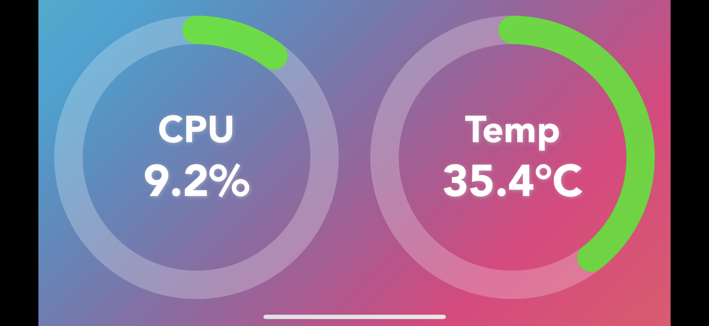

# Remote Resource Monitor Lite

This is a simple vue project to display CPU and memory usage nicer on your mobile devices such as mobiles and tablets.

This requires [cpu-monitor-express-webapp](https://github.com/mitchleung/cpu-monitor-express-webapp) to be setup and running first.

## Project setup
```
npm install
```

### Compiles and hot-reloads for development
```
npm run serve
```

### Compiles and minifies for production
```
npm run build
```

### Lints and fixes files
```
npm run lint
```

### Customize configuration
See [Configuration Reference](https://cli.vuejs.org/config/).


### Run from dist folder
```
http-server dist -p [port]
```

You can also build the project once and run directly from "dist" folder at specific port with [http-server](https://www.npmjs.com/package/http-server)


And then go to the IP address of your desktop/laptop from browser of mobile devices, e.g. http://192.168.1.123:12345

On iOS, you can add to Home screen so that it can stay full screen without any toolbars.

## Landscape mode



### License
MIT License &copy; Mitch Leung
